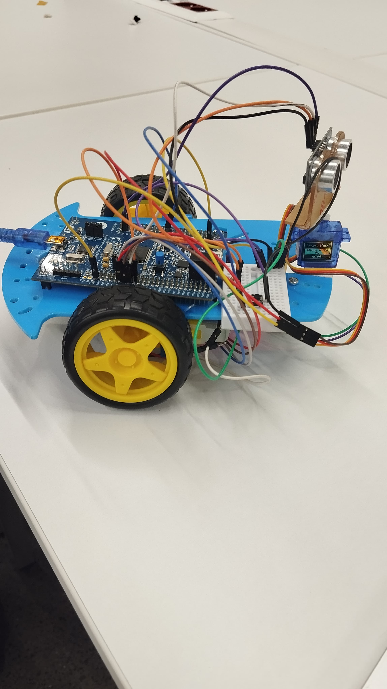
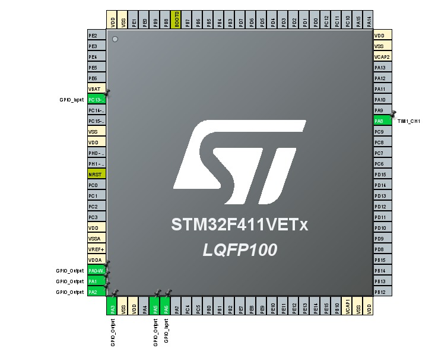

# STM32F411 tabanlı Otonom Engelden Kaçan Robot Köpek Projesi

Bu proje, Mikroişlemciler dersi kapsamında STM32F411VET6 mikrodenetleyicisi ve STM32CubeIDE (HAL kütüphanesi) kullanılarak geliştirilmiş otonom bir robot köpek projesidir. Robot, önündeki engelleri algılayıp en güvenli yöne dönerek otonom bir şekilde hareket etmektedir.

## 🛠️ Donanım Özellikleri & Pin Yapılandırması
* **Mikroişlemci:** STM32F411VET6 (ARM Cortex-M4)
* **Mesafe Sensörü:** HC-SR04 Ultrasonik Sensör
  * `TRIG_PIN`: GPIOA - Pin 5 (Output)
  * `ECHO_PIN`: GPIOA - Pin 6 (Input)
* **Motor Sürücü & DC Motorlar:** Robotun ileri/geri ve dönüş hareketlerini kontrol eden H-Köprüsü yapısı.
  * `IN1`, `IN2`, `IN3`, `IN4`: GPIOA - Pin 0, 1, 2, 3 (Output)
* **Servo Motor (Kafa Mekanizması):** Sensörün sağa ve sola bakmasını sağlayan PWM kontrollü servo.
  * `TIM1_CH1`: GPIOA - Pin 8 (PWM Generation)
* **Zamanlayıcı (Timer 2):** Ultrasonik sensörün mikrosaniye cinsinden sinyal süresini ölçmek için hassas `delay_us()` fonksiyonu.
* **Kullanıcı Etkileşimi:** * `BUTTON_PIN`: GPIOC - Pin 13 (Mavi Dahili Buton - Projeyi Başlatma/Durdurma)

## 🧠 Çalışma Algoritması (Yazılım Mantığı)
1. **Güvenli Başlatma:** Robot ilk açıldığında `BUTTON_PIN` (PC13) basılana kadar motorları kapalı tutar ve bekler.
2. **Mesafe Ölçümü:** Sensör düz konuma (90 derece) getirilir ve önündeki mesafe ölçülür.
3. **Karar Mekanizması:**
   * Önündeki mesafe **10 cm'den (SAFE_DISTANCE)** büyükse robot **İleri (forward)** hareket eder.
   * Önünde bir engel algılandığında motorlar durur.
4. **Çevre Tarama:** * Kafadaki servo motor önce **30 dereceye (Sağ)** dönerek sağdaki mesafeyi ölçer.
   * Ardından **150 dereceye (Sol)** dönerek soldaki mesafeyi ölçer.
5. **Yön Seçimi:** Robot, sağ ve sol mesafe ölçümlerini kıyaslar; hangi tarafın yolu daha açıksa (mesafe daha büyükse) o yöne doğru akıllı bir dönüş (`turn_right` veya `turn_left`) gerçekleştirir und yoluna devam eder.

## 📸 Proje Görselleri ve Pin Şeması

### Robot Köpek Tasarımı

  
  

### STM32 Pin Dizilimi

## 📁 Proje Klasör Yapısı & Kurulum
GitHub reposuna yüklerken temiz bir yapı sunmak adına aşağıdaki klasörler eklenmiştir:
* **Core/Src/main.c:** Projenin ana algoritmasının, motor sürücü fonksiyonlarının ve çevre tarama mantığının yer aldığı kaynak kod.
* **final1.ioc:** STM32CubeMX grafik arayüz konfigürasyon dosyası. (Pinlerin ve çevre birimlerinin ayarları bu dosya üzerinden incelenebilir).
* **STM32F411VETX_FLASH.ld & RAM.ld:** Mikrokontrolcü hafıza haritasını belirleyen Linker Script dosyaları.

## 💻 Kullanılan Teknolojiler
* **C Dili** (Embedded C)
* **STM32CubeIDE** & STM32 HAL Kütüphanesi
* **PWM** (Sinyal Genişlik Modülasyonu) ile Servo Kontrolü
* **Input Capture / Timer Counter** ile Mesafe Hesaplama
