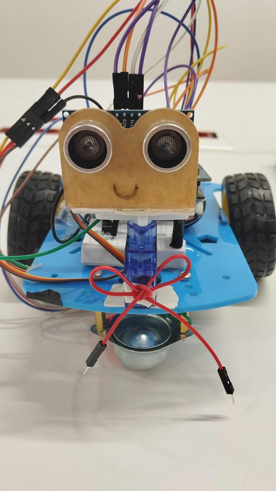

# STM32F411-Based Autonomous Obstacle-Avoiding Smart Car

This project is an autonomous smart car developed as part of the Microprocessors course using the STM32F411VET6 microcontroller and STM32CubeIDE (HAL Library). The vehicle autonomously navigates its environment by detecting obstacles and turning towards the safest path.

## 🛠️ Hardware Features & Pin Configuration
* **Microcontroller:** STM32F411VET6 (ARM Cortex-M4)
* **Distance Sensor:** HC-SR04 Ultrasonic Sensor
  * `TRIG_PIN`: GPIOA - Pin 5 (Output)
  * `ECHO_PIN`: GPIOA - Pin 6 (Input)
* **Motor Driver & DC Motors:** L298N / H-Bridge structure controlling the forward, backward, and turning movements of the vehicle.
  * `IN1`, `IN2`, `IN3`, `IN4`: GPIOA - Pin 0, 1, 2, 3 (Output)
* **Servo Motor (Sensor Mechanism):** PWM-controlled servo that rotates the ultrasonic sensor left and right to scan the environment.
  * `TIM1_CH1`: GPIOA - Pin 8 (PWM Generation)
* **Timer (Timer 2):** High-precision `delay_us()` function utilized to measure the ultrasonic signal duration in microseconds.
* **User Interaction:** * `BUTTON_PIN`: GPIOC - Pin 13 (Onboard Blue Button - Starts/Stops the vehicle)

## 🧠 Control Algorithm & Software Logic
1. **Safe Initialization:** Upon power-up, the vehicle keeps the motors disabled and waits until the `BUTTON_PIN` (PC13) is pressed.
2. **Distance Measurement:** The servo positions the sensor facing straight ahead (90 degrees) to measure the front distance.
3. **Decision Making:**
   * If the forward distance is greater than **10 cm (SAFE_DISTANCE)**, the vehicle moves **Forward**.
   * If an obstacle is detected within this range, the motors stop immediately.
4. **Environment Scanning:** * The servo motor rotates to **30 degrees (Right)** to measure the distance on the right side.
   * Then, it rotates to **150 degrees (Left)** to measure the distance on the left side.
5. **Path Selection:** The algorithm compares the left and right distance measurements. It executes a smart turn (`turn_right` or `turn_left`) towards the side with more clearance and continues its forward navigation.

## 📸 Project Media and Pinout

### Smart Car Design

  
  

### STM32 Pin Configuration

## 📁 Project Structure

The repository includes the following essential project files:
* **Core/Src/main.c:** The core application source code containing motor driver functions, sensor calculation logic, and the main navigation algorithm.
* **final1.ioc:** STM32CubeMX graphical configuration file containing peripheral and pinout definitions.
* **STM32F411VETX_FLASH.ld & RAM.ld:** Linker Script files defining the memory mapping of the microcontroller.

*Note: The `Debug/` folder containing local build artifacts (.o, .elf, .d files) is excluded to keep the repository clean.*

## 💻 Technologies Used
* **Embedded C**
* **STM32CubeIDE** & STM32 HAL Library
* **PWM (Pulse Width Modulation)** for Servo Control
* **Input Capture / Timer Counter** for Ultrasonic Sensor Handling
